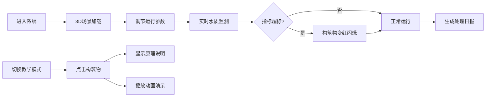

## 1. 产品概述

基于Three.js的3D污水处理厂工艺流程模拟系统，通过交互式3D可视化展示污水处理全过程，支持实时参数调节和水质监测，兼具工程仿真和教学科普功能。

- **核心价值**：将复杂的污水处理工艺以直观的3D形式呈现，实现运行模拟、参数优化和教学演示
- **目标用户**：环境工程专业师生、污水处理厂运营人员、环保技术研发人员
- **市场定位**：专业的污水处理工艺可视化仿真工具

## 2. 核心功能

### 2.1 Feature Module

1. **3D场景模块**：污水处理厂构筑物建模、动态水流粒子效果、场景交互控制
2. **运行控制模块**：进水流量调节、曝气强度控制、工艺参数实时调整
3. **水质监测模块**：实时显示各单元水质指标（COD、氨氮、总磷、pH）、超标警报
4. **数据报表模块**：处理日报生成、进出水水质对比、达标率统计
5. **教学模式模块**：构筑物工作原理说明、工艺流程动画演示、知识点讲解

### 2.2 Page Details

| 页面名称 | 模块名称 | 功能描述 |
|-----------|-------------|---------------------|
| 主场景页 | 3D视图 | 污水处理厂全景3D展示，支持旋转、缩放、平移交互 |
| 主场景页 | 控制面板 | 进水流量滑块、曝气强度滑块、运行/暂停按钮 |
| 主场景页 | 水质面板 | 各处理单元实时水质指标显示，超标变红闪烁 |
| 主场景页 | 排放标准配置 | 设定各指标排放限值，可保存自定义标准 |
| 主场景页 | 日报生成 | 生成当日处理报告，包含水质对比、处理量、达标率 |
| 主场景页 | 教学模式 | 点击构筑物弹出原理说明和动画演示 |

## 3. 核心流程

用户进入系统后，首先看到完整的3D污水处理厂场景。可以通过控制面板调节进水流量和曝气强度，观察各处理单元的水位变化和水质改善效果。水质指标实时更新，当某项指标超标时对应构筑物变红闪烁。用户可以切换到教学模式，点击任意构筑物查看详细的工作原理说明和动画演示。系统支持生成处理日报，汇总当日运行数据。

## 4. 用户界面设计

### 4.1 Design Style

- **主色调**：深蓝色系（#0a2463, #3e92cc）代表水体和科技感，青色（#2ec4b6）代表环保，红色（#e71d36）作为警报色
- **背景**：深灰色渐变背景（#1a1a2e → #16213e），营造工业科技氛围
- **按钮风格**：圆角矩形，带微妙阴影和悬停动效
- **字体**：标题使用 Orbitron 字体增强科技感，正文使用 Inter 字体保证可读性
- **图标风格**：线性图标，统一使用 lucide-react 图标库

### 4.2 Page Design Overview

| 页面名称 | 模块名称 | UI Elements |
|-----------|-------------|-------------|
| 主场景页 | 3D视图 | 全屏3D画布，半透明构筑物模型，动态水流粒子，发光边框 |
| 主场景页 | 控制面板 | 左侧悬浮玻璃态面板，滑块控件，数值显示，开关按钮 |
| 主场景页 | 水质面板 | 底部横向排列的指标卡片，带颜色编码和趋势箭头 |
| 主场景页 | 模态框 | 排放标准配置、日报展示、教学说明均使用居中模态框 |
| 主场景页 | 警报提示 | 右上角Toast通知，超标时闪烁红光 |

### 4.3 Responsiveness

- **设计策略**：桌面优先，自适应布局
- **3D画布**：始终占满视口，响应式调整渲染分辨率
- **控制面板**：桌面端左侧悬浮，平板端顶部折叠，移动端抽屉式
- **水质面板**：桌面端横向排列，移动端纵向滚动
- **交互优化**：桌面端鼠标+键盘，移动端触摸手势支持

### 4.4 3D Scene Guidance

- **环境与氛围**：深蓝色环境光，定向太阳光模拟日间，构筑物边缘发光效果
- **光照设置**：AmbientLight + DirectionalLight + 构筑物点光源，水体使用自发光材质
- **相机设置**：PerspectiveCamera，初始45度俯视视角，支持OrbitControls自由控制
- **动画与交互**：
  - 水流粒子系统：BufferGeometry + PointsMaterial，沿工艺流向运动
  - 曝气效果：气泡粒子从曝气池底部上升
  - 水位变化：根据进水流量动态调整水池水位高度
  - 水质颜色：根据COD浓度调整水体颜色（深褐色→淡青色）
  - 超标闪烁：超标构筑物红色脉冲发光效果
- **后期处理**：BloomEffect增强发光效果，FXAA抗锯齿
- **性能优化**：InstancedMesh处理重复粒子，LOD控制细节，帧率动态调整
