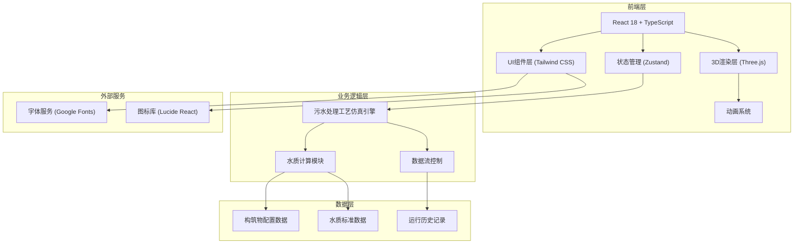
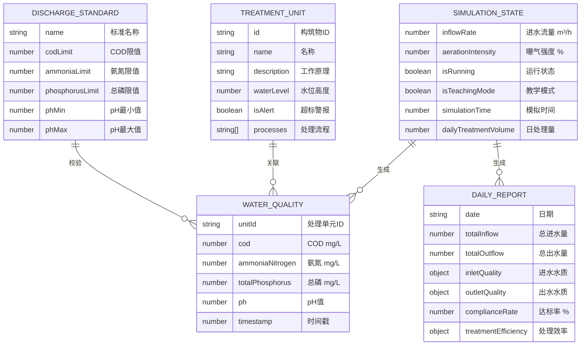

## 1. Architecture Design



## 2. Technology Description

- **前端框架**：React 18 + TypeScript
- **构建工具**：Vite 5.0
- **样式方案**：Tailwind CSS 3.4
- **状态管理**：Zustand 4.5
- **3D引擎**：Three.js 0.160 + @react-three/fiber 8.15 + @react-three/drei 9.92
- **后处理**：@react-three/postprocessing 2.15
- **路由**：React Router DOM 6.21
- **图标**：Lucide React 0.294
- **后端**：无（纯前端应用，数据本地存储）

## 3. Route Definitions

| Route | Purpose |
|-------|---------|
| / | 主场景页 - 3D污水处理厂模拟系统 |

## 4. Data Model

### 4.1 数据模型定义



### 4.2 数据结构定义

```typescript
// 处理单元类型
type TreatmentUnitType = 'grate' | 'sandTank' | 'primaryTank' | 'aerationTank' | 'secondaryTank' | 'disinfectionTank';

// 水质指标
interface WaterQuality {
  cod: number;
  ammoniaNitrogen: number;
  totalPhosphorus: number;
  ph: number;
}

// 处理单元状态
interface TreatmentUnit {
  id: TreatmentUnitType;
  name: string;
  description: string;
  waterLevel: number;
  maxWaterLevel: number;
  waterQuality: WaterQuality;
  isAlert: boolean;
  position: { x: number; y: number; z: number };
  size: { width: number; height: number; depth: number };
}

// 排放标准
interface DischargeStandard {
  name: string;
  cod: number;
  ammoniaNitrogen: number;
  totalPhosphorus: number;
  phMin: number;
  phMax: number;
}

// 模拟状态
interface SimulationState {
  inflowRate: number;
  aerationIntensity: number;
  isRunning: boolean;
  isTeachingMode: boolean;
  simulationTime: number;
  units: Record<TreatmentUnitType, TreatmentUnit>;
  standard: DischargeStandard;
  dailyReport: DailyReport | null;
}

// 日报数据
interface DailyReport {
  date: string;
  totalInflow: number;
  totalOutflow: number;
  inletQuality: WaterQuality;
  outletQuality: WaterQuality;
  complianceRate: number;
  treatmentEfficiency: {
    cod: number;
    ammoniaNitrogen: number;
    totalPhosphorus: number;
  };
  alertRecords: {
    unit: string;
    parameter: string;
    timestamp: number;
  }[];
}
```

## 5. 核心模块设计

### 5.1 目录结构

```
src/
├── components/
│   ├── Scene/               # 3D场景组件
│   │   ├── TreatmentPlant.tsx    # 污水处理厂主场景
│   │   ├── Tank.tsx              # 水池构筑物组件
│   │   ├── WaterParticles.tsx    # 水流粒子系统
│   │   ├── AerationBubbles.tsx   # 曝气气泡系统
│   │   └── Lights.tsx            # 光照系统
│   ├── ControlPanel/         # 控制面板
│   │   ├── ParameterControls.tsx # 参数调节
│   │   ├── StandardConfig.tsx    # 排放标准配置
│   │   └── TeachingMode.tsx      # 教学模式
│   ├── WaterQualityPanel/    # 水质面板
│   │   ├── QualityCard.tsx       # 水质指标卡片
│   │   └── QualityTrend.tsx      # 趋势图
│   ├── Report/               # 报表模块
│   │   ├── DailyReportModal.tsx  # 日报弹窗
│   │   └── ReportGenerator.ts    # 报表生成
│   └── UI/                   # 通用UI
│       ├── Modal.tsx             # 模态框
│       ├── Slider.tsx            # 滑块
│       └── AlertToast.tsx        # 警报提示
├── store/                  # 状态管理
│   └── useSimulationStore.ts
├── hooks/                  # 自定义Hooks
│   ├── useWaterQuality.ts      # 水质计算
│   ├── useSimulationLoop.ts    # 仿真循环
│   └── useTankAnimation.ts     # 构筑物动画
├── utils/                  # 工具函数
│   ├── waterTreatment.ts       # 水处理计算
│   ├── reportGenerator.ts      # 报表生成
│   └── constants.ts            # 常量配置
├── types/                  # 类型定义
│   └── index.ts
├── App.tsx
├── main.tsx
└── index.css
```

### 5.2 核心算法

1. **水质处理算法**：基于进水流量和曝气强度，按照各处理单元的去除效率模型实时计算水质变化
2. **粒子系统算法**：使用BufferGeometry + ShaderMaterial实现高效的水流和气泡粒子动画
3. **超标检测算法**：实时比对各单元水质指标与排放标准，触发警报和视觉反馈
4. **达标率计算**：统计采样周期内各指标达标次数占比，生成处理效率分析
